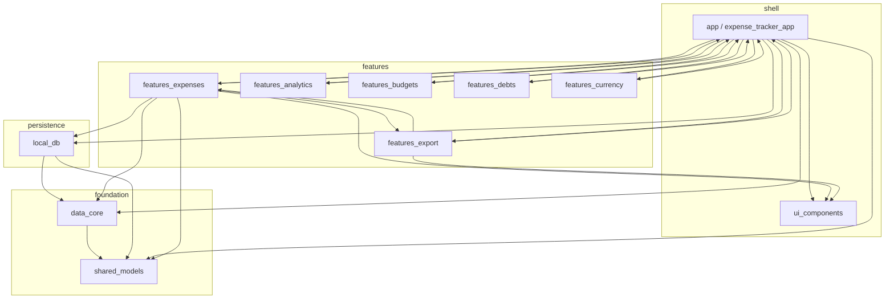

# Архитектура Expense Tracker

Документ описывает структуру монорепозитория, границы пакетов, потоки данных и ключевые технические решения. Детали продуктового видения и roadmap — в [README.md](README.md).

---

## 1. Высокоуровневая модель

Приложение собрано как **модульный монорепозиторий** (Melos: `melos.yaml`, пакеты в `packages/`). Точка входа — корневой Flutter-проект (`lib/main.dart` → `expense_tracker_app`).

- **UI и навигация** живут преимущественно в фичах и в пакете `app`.
- **Доменные сущности** — в `shared_models`.
- **Контракты доступа к данным** — в `data_core`; **реализация на устройстве** — в `local_db` (Drift).
- **Состояние** — `flutter_riverpod`; **маршрутизация** — `go_router` (конфигурация в `app`).

Архитектура фич близка к **feature-first**: у каждого модуля `features_*` своя папка `presentation/`, провайдеры и при необходимости сервисы. Строгого разделения на слои `domain/data/presentation` внутри каждой фичи нет единообразно — граница «чистоты» проходит между **репозиториями (`data_core` + `local_db`)** и **остальным кодом**.

---

## 2. Диаграмма зависимостей пакетов

Упрощённый граф (стрелка: «зависит от»):

**Замечание о циклах.** Пакет `app` тянет фичи, а ряд фич (`features_expenses`, `features_export`, `features_analytics`, …) объявляет зависимость на `expense_tracker_app` для доступа к общим провайдерам, теме, настройкам (`bootstrap`, `sharedPreferencesProvider`, ключи API и т.д.). Это **осознанный компромисс** текущей структуры: compositional root — `app`, но обратные ссылки идут через тот же пакет. При масштабировании целевое направление — вынести общие провайдеры в отдельный тонкий пакет (например `app_core` / `core_providers`) без зависимости фич от полного `app`.

---

## 3. Описание пакетов

| Пакет | Назначение |
|--------|------------|
| **shared_models** | Неизменяемые модели и утилиты (например `Expense`, `Category`, черновики импорта, `extractKeywordFromNote` для правил). Без Flutter. |
| **data_core** | Абстракции: `ExpensesRepository`, `CategoriesRepository`, `CategoryRulesRepository`, `BudgetsRepository`, `DebtsRepository`, `RecurringExpensesRepository`, контракты синхронизации. Без Flutter. |
| **local_db** | Drift-схемы, `AppDatabase`, конкретные реализации репозиториев из `data_core`. |
| **ui_components** | Дизайн-система: `PrimaryScaffold`, `BalanceCard`, `GlassCard`, `EnhancedExpenseCard`, `QuickActions`, `EmptyState`, скелетоны, токены анимаций (`AppMotion`), общие анимации. |
| **app** (`expense_tracker_app`) | `MaterialApp.router`, `GoRouter`, тема (`AppTheme`, Manrope), онбординг, главный экран, настройки, биометрия, жизненный цикл. Собирает маршруты фич. |
| **features_expenses** | Список операций, форма траты, категории, правила категоризации, повторяющиеся траты; провайдеры потоков и репозиториев; `CategorizationService`. |
| **features_analytics** | Экран аналитики, виджеты графиков, **Behavior Engine** (ожидаемые траты, отклонения, тренд), `homeDecisionEngineProvider` для главной. |
| **features_budgets** | Бюджеты: список, форма, сводка на главной. |
| **features_debts** | Долги: список, форма. |
| **features_currency** | Валюты и курсы (сервисы/провайдеры для конвертации в аналитике). |
| **features_export** | Импорт CSV/JSON/PDF, экспорт, бэкап, экран **Import Review**, обучение правил (`ImportReviewLearningService`). |
| **sync_api** | Клиент/контракты синхронизации (при необходимости расширения облака). |

---

## 4. Данные и репозитории

- Таблицы Drift объявлены в `packages/local_db` (расходы, категории, бюджеты, долги, правила категоризации, повторяющиеся операции и т.д.).
- Фичи не обращаются к Drift напрямую: используют **интерфейсы из `data_core`** и провайдеры, отдающие реализации из `local_db` (часто через `Provider` / `StreamProvider` в `features_expenses` или `app`).

Поток записи типичной траты: **UI → Notifier/Controller → Repository (`upsertExpense`) → Drift**.

---

## 5. Состояние и навигация

- **Riverpod**: `Provider`, `StateNotifierProvider`, `FutureProvider`, `StreamProvider`, `autoDispose` там, где нужен сброс при уходе с экрана (например review импорта).
- **GoRouter** создаётся в `packages/app/lib/src/app.dart`, читает флаги вроде завершения онбординга (`onboardingCompletedProvider`), объявляет пути `/`, `/onboarding`, `/expenses`, `/import`, `/import/review`, `/analytics`, `/settings` и вложенные маршруты фич.

---

## 6. Импорт и цикл обучения (сжатое описание)

1. Пользователь выбирает файл на `ImportPage` → `ImportService` парсит в список сущностей, близких к `Expense`.
2. `CategorizationService` обогащает записи (категории, confidence, флаги для review).
3. Состояние черновика кладётся в `importReviewControllerProvider`, открывается `/import/review`.
4. После подтверждения — пакетная запись через `ExpensesRepository`, затем при расхождении с предсказанием — **upsert правил** в `CategoryRulesRepository` (`ImportReviewLearningService`), с единым пайплайном ключевых слов (`extractKeywordFromNote`).

Подробнее смысл цикла — в README (Financial Brain / правила).

---

## 7. UI и тема

- Нормативный контракт дизайн-системы (режимы экранов, поверхности, типографика, цвет, motion, чеклист): **[DESIGN_SYSTEM.md](DESIGN_SYSTEM.md)**.
- Глобальная тема: `packages/app/lib/src/core/theme/app_theme.dart` — Material 3, seed-цвета по `AppThemeType`, **Google Fonts Manrope**, скругления карточек и кнопок в духе neo-bank.
- Локализация: **easy_localization**, JSON в `assets/translations/`; корневой `pubspec.yaml` подключает assets.

---

## 8. Сборка и окружение

- Разработка и анализ: из корня репозитория (`flutter pub get`, `dart analyze`, скрипты Melos при необходимости).
- Android: каталог `android/` в корне; иконка и splash настраиваются через `flutter_launcher_icons` / `flutter_native_splash` в корневом `pubspec.yaml`.
- iOS: при появлении целевой платформы — отдельная настройка в Xcode (см. документацию проекта, например `IOS_BIOMETRIC_SETUP.md` при наличии).

---

## 9. Расширение архитектуры

- **Новая фича**: пакет `packages/features_<name>` с зависимостью на `shared_models`, `data_core`, `ui_components`, при необходимости `flutter_riverpod` и `go_router`; регистрация маршрутов в `app.dart` и экспорт публичного API из `features_<name>.dart`.
- **Новая сущность БД**: таблица и миграция в `local_db`, модель в `shared_models`, методы в интерфейсе репозитория `data_core`, реализация в `local_db`.
- **Снижение связности**: постепенно убрать зависимость фич от пакета `app`, вынеся провайдеры настроек и конфигурации в отдельный пакет без UI.

---

*Последнее обновление документа: по состоянию кодовой базы монорепозитория expense_tracker_flutter.*
